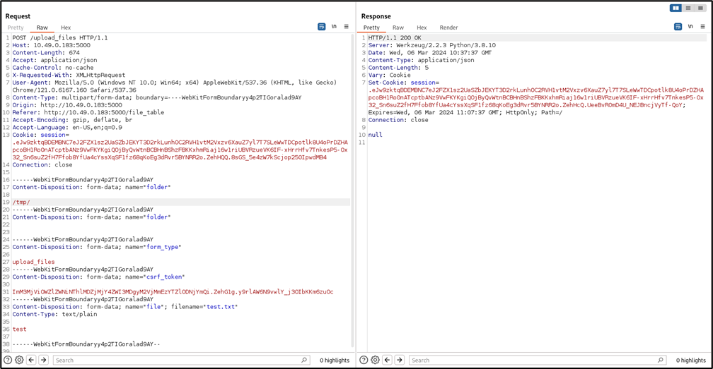
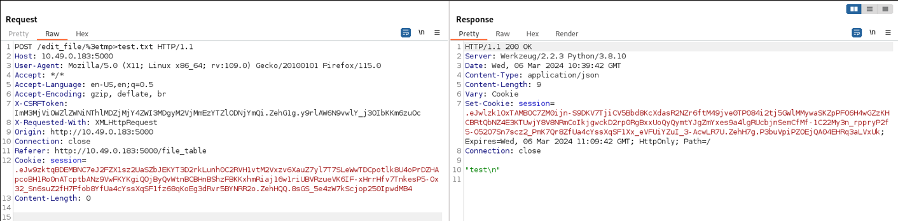

# **CVE-2024-46647**
# Details
* **Vulnerability Type**: eNMS 4.4.0 < 4.7.1 Directory Traversal via upload_files
* **Affected Application**: eNMS
* **Affected Versions**: 4.4.0 < 4.7.1
* **Affected Component**: /upload_files
* **Impact**: Unauthorized access to sensitive files, potential exposure of confidential information.

# PoC
##  ```POST /upload_files/[DIR]/[FILE]```

If the SSH services is exposed, upload SSH authorized_keys tampering the ```folder``` parameter, or eventually upload a web shell.
<br/><br/>
Uploading the file within the ```/tmp``` directory:




File uploaded correctly:


# References
https://www.cve.org/CVERecord?id=CVE-2024-46644
# Credits
**Andrea Pessione** and **Manuel Scala** - SK IT Cyber Security<br></br>
<a href="https://sk-it.com/">
